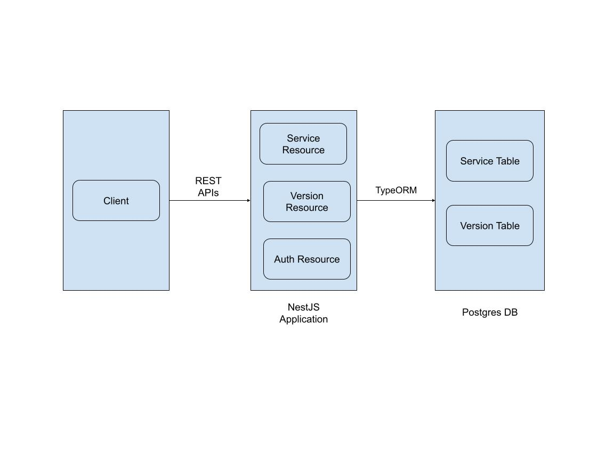
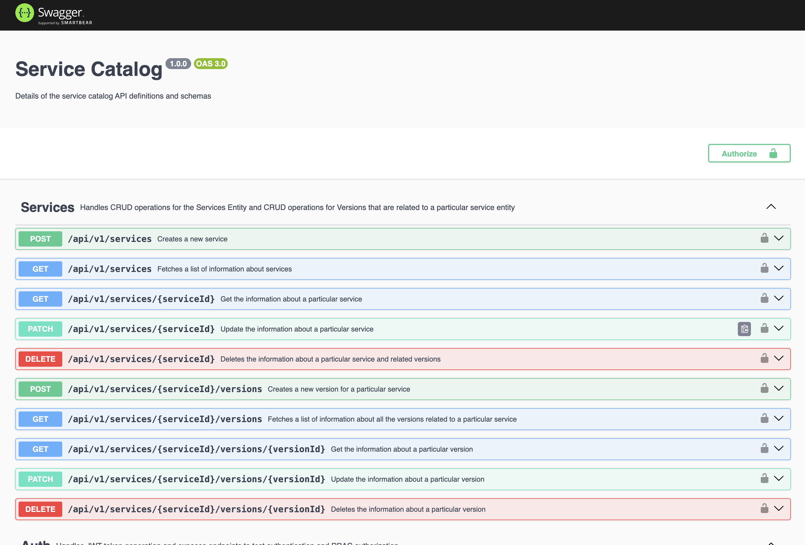

# Service Catalog Microservice

## Overview
The **Service Catalog Microservice** is a backend solution for managing and interacting with services and their respective versions. Built with scalability, reliability, and developer usability in mind, this project ensures streamlined service management with robust query capabilities, versioning, and comprehensive documentation. This README outlines the system architecture, design choices, setup instructions, and potential future enhancements.

---

## Features
- **CRUD Operations**: Create, read, update, and delete services and versions.
- **Search and Filter**: Search services by name and description, with substring-based search functionality.
- **Pagination**: Efficient pagination for listing services and their versions.
- **Soft Deletes**: Safely archive services and versions without permanently removing data.
- **Authentication and Authorization**: Secure access control using role-based policies.
- **Comprehensive Testing**: Includes unit, integration, and end-to-end tests.
- **Swagger Documentation**: Built-in Swagger UI for API exploration and testing.

---

## System Overview



---

## Tech Stack
- **Node.js**: Runtime environment. (v22)
- **NestJS**: Backend framework. (v10)
- **TypeORM**: ORM for database interactions. (v0.3)
- **PostgreSQL**: Relational database. (v15)
- **Swagger**: API documentation.
- **Docker**: Containerization.
- **TypeScript**: Static typing.
- **Jest**: Testing framework.

---

## Design Tradeoffs

Designing the Service Catalog microservice involved making several critical decisions. Below are the key tradeoffs considered for specific features:

---

### Calculating the Number of Versions

#### **Option 1: Calculated Field Using Count and Joins**
- **Pros**:
  - Reduces storage requirements since the count is dynamically calculated.
  - Ensures accurate and up-to-date information as the data is queried directly from the database.
- **Cons**:
  - Performance overhead for frequently queried services, especially with a high number of versions.
  - May lead to slower response times if the database grows significantly.

#### **Option 2: Persist Data in the Database**
- **Implementation**:
  - A `version_count` field is added to the `services` table.
  - Every create, update, or delete operation on versions triggers an update in the `version_count` field.
- **Pros**:
  - Optimized read performance as the count is pre-calculated and stored.
  - Ideal for use cases with frequent reads and infrequent updates.
- **Cons**:
  - Increased complexity in maintaining data consistency.
  - Risk of stale data if not properly synchronized during transactions.

### Choice made - Option 1:  Calculated Field Using Count and Joins
---

### Search Implementation

#### **Option 1: Search Mechanism Using ILIKE**
- **Implementation**:
  - Substring matching is performed using PostgreSQL's `ILIKE` operator for case-insensitive searches.
- **Pros**:
  - Simple and efficient for basic search needs.
  - Allows partial matches, enhancing flexibility for users.
- **Cons**:
  - Limited functionality for more complex search scenarios, such as phrase matching or ranking results.

#### **Option 2: Full-Text Search Using PostgreSQL**
- **Implementation**:
  - Utilize PostgreSQL's full-text search capabilities with `tsvector` and `tsquery`.
- **Pros**:
  - Enables advanced search features like stemming, ranking, and phrase matching.
  - Performs well with large datasets.
- **Cons**:
  - Increased setup and maintenance complexity.
  - Slightly higher storage requirements due to indexing.

### Choice made - Option 1:  Search Mechanism Using ILIKE

---

### Pagination Implementation

#### **Option 1: Page and Limit**
- **Implementation**:
  - Uses `page` (current page number) and `limit` (number of items per page) query parameters.
- **Pros**:
  - Easy to implement and intuitive for developers and users.
  - Works well for smaller datasets and straightforward applications.
- **Cons**:
  - Performance degradation with large datasets, as every page recalculates offsets.
  - Susceptible to data inconsistency if the dataset changes between requests.

#### **Option 2: Cursor-Based Pagination**
- **Implementation**:
  - Uses a unique field (e.g., `id` or timestamp) to fetch items after a specific cursor value.
- **Pros**:
  - More efficient for large datasets as it avoids offset recalculations.
  - Prevents issues caused by data mutations during pagination.
- **Cons**:
  - Slightly more complex to implement and use.
  - Requires careful selection of the cursor field for optimal results.

### Choice made - Option 1:  Page and Limit

---

### Deleting Entities: Soft Delete vs Hard Delete

#### **Option 1: Soft Delete**
- **Implementation**:
  - Add a `deleted_at` column to mark an entity as deleted without actually removing it from the database.
- **Pros**:
  - Data recovery is possible, reducing the risk of accidental loss.
  - Retains historical data for audits or analytics.
- **Cons**:
  - Additional storage requirements for logically deleted records.
  - Application logic becomes more complex due to the need to filter out soft-deleted entities in queries.

#### **Option 2: Hard Delete**
- **Implementation**:
  - Permanently remove the entity from the database.
- **Pros**:
  - Simplifies database design and reduces storage requirements.
  - Faster queries since no additional filtering is required.
- **Cons**:
  - Irreversible; no way to recover deleted data.
  - Not suitable for systems requiring audit trails or historical data.

### Choice made - Option 1:  Soft Delete
Bonus: Implicit transactions are performed by TypeORM using cascade properties to ensure data consistency across operations.

---

## Assumptions
- Searches can only be performed on the `name` and `description` properties of a service.
- Search functionality supports **substring matches** rather than strict equality, phrase matching or other complex types.
- Each service must have **at least one version** to exist in the system. The service does not allow deleting of a version if it is the only one belonging to a particular service.

---

## Database Design
Below is the database schema diagram:

```
Services Table:
- id (Primary Key, UUID)
- name (Indexed)
- description
- created_at (Indexed)
- updated_at
- deleted_at (Soft Delete, Indexed)
- no_of_versions (Calculated, not persisted)
- idx_service_name_description (Composite index on name and description)

Versions Table:
- id (Primary Key, UUID)
- service_id (Foreign Key, Indexed)
- name
- overview
- created_at
- updated_at
- deleted_at (Soft Delete, Indexed)
```

---

## Implementation Details
A breakdown of how different components interact in the system.

---

### **Global Route Prefix and Versioning**
- **Description**: Establishes a consistent API structure and supports versioning to ensure backward compatibility.
- **Implementation**:
  - A global prefix (`api`) is applied to all API routes.
  - URI-based versioning (`/v1`, `/v2`, etc.) is enabled to allow version-specific endpoints.

---

### **Request Validation and Sanitization**
- **Description**: Ensures that incoming requests adhere to defined schemas and are sanitized.
- **Features**:
  - **Validation**: Requests are checked for adherence to defined DTOs (Data Transfer Objects).
  - **Type Transformation**: Automatically converts query and body parameters to their native types (e.g., strings to integers).
  - **Error Handling**: Non-conforming requests are rejected with a `BadRequestException`.
- **Implementation**:
  - `ValidationPipe` is globally applied with the following options:
    - `forbidNonWhitelisted`: Rejects extra properties not defined in the DTO.
    - `transform`: Automatically converts values to their appropriate types.

---

### **Response Transformation**
- **Description**: Enhances responses by stripping non-exposed fields and adding top-level keys for consistency.
- **Features**:
  - Strips all unexposed fields from API responses.
  - Adds keys like `data`, `status_code`, etc., to ensure uniformity and backward compatibility.
- **Implementation**:
  - A global response interceptor (`TransformResponseInterceptor`) is applied with the strategy set to `excludeAll`.

---

### **Global Error Handling**
- **Description**: Implements a unified mechanism to handle exceptions and errors.
- **Features**:
  - Catches all unhandled errors and formats them into a consistent error response DTO.
  - Logs critical errors for debugging and auditing.
- **Implementation**:
  - A global filter (`CatchEveryErrorFilter`) is applied to transform exceptions and send user-friendly error messages.

---

### **Swagger API Documentation**
- **Description**: Provides interactive API documentation using Swagger.
- **Features**:
  - Includes detailed descriptions and schemas for all endpoints.
  - Organizes endpoints into tags for better readability:
    - **Services**: Manages CRUD operations for Services and their associated Versions.
    - **Auth**: Handles JWT authentication and RBAC authorization.
  - Adds a Bearer token authentication mechanism to support secured endpoints.
- **Implementation**:
  - Available at the `/api-docs`.

---


### Sample Request Response Flow
```plaintext
Request Received
   ├── Request Validation and Transformation Pipe
   ├── Authentication Interceptors (Pre-Controller)
   ├── Authorization role Guards
   ├── Route-Specific Pipes
   ├── Controller Method
   │       ├── Services
   │       └── Repository/Data Layer
   ├── DTO value stripping and serialization
   └── Exception Handling Filter
Response Sent
```


---

## Authentication and Authorization
### Authentication and Authorization

The application implements robust authentication and role-based authorization mechanisms using decorators like `@Public()` and `@Roles([])` for flexibility and fine-grained control. Here's a breakdown of how authentication and authorization are integrated:

---

#### **Authentication**

Authentication is handled via JSON Web Tokens (JWT). The `AuthController` provides endpoints for generating tokens and accessing resources. Key points include:

- **JWT Token Generation**:
  - The `generate-token` endpoint allows generating a JWT for a user with specific roles.
  - The token includes claims such as the user's ID and roles, which are later used for authorization.

- **Public Endpoints**:
  - Endpoints marked with the `@Public()` decorator can be accessed without authentication or authorization.

---

#### **Authorization**

Authorization uses roles to restrict access to specific resources. The `@Roles([])` decorator enforces role-based access control (RBAC).

- **Role-Based Access**:
  - Endpoints require specific roles to access. For example, an admin endpoint requires the `Admin` role, while a user endpoint requires the `User` role.

- **Role Combinations**:
  - Some endpoints require multiple roles. The `@Roles([])` decorator accepts an array of roles, and users must have all specified roles to access the endpoint.

---

#### **Key Decorators and Usage**

1. **`@Public()`**:
   - Used to mark endpoints as public, bypassing authentication and authorization checks.
   - Typical use cases include health check endpoints or public-facing APIs.

2. **`@Roles([])`**:
   - Specifies the roles required to access an endpoint.
   - Role checking is performed by a guard that validates the user's roles from the JWT payload.

---

## Testing

### Unit and Integration Tests
- Written using **Jest** to ensure coverage of service logic and controller behavior.
- Utilizes a handy tool to deal with complex test dependencies: mocking and stubbing with the help of @golevelup/ts-jest.
- Currently tests written only for the services.controller.ts and services.service.ts file with 100% code coverage to demonstrate use case.

### End-to-End (E2E) Testing

E2E tests simulate real-world scenarios by interacting with the application via HTTP requests, covering database interactions, service logic, and API responses.

---

#### **Testing Strategy**

1. **Database Integration**:
   - The tests connect to a live PostgreSQL database defined in the `TypeOrmModule.forRoot()` configuration.
   - The schema is synchronized during setup to ensure compatibility.

2. **Test Isolation**:
   - After each test, database tables are cleared to ensure that tests are independent and free of side effects.

---

#### **Pre-requisites**

To run the E2E tests:
- A PostgreSQL database should be running locally with the following configurations:
  - **Host**: `localhost`
  - **Port**: `5440`
  - **Username**: `test_postgres_user`
  - **Password**: `test_postgres_password`
  - **Database Name**: `test_service_catalog_pgdb`

---

#### **Test: Retrieving a Service by ID**

Currently one flow has been implemented to demonstrate the implementation of E2E test. It tests fetching a services information by providing the service id. Following are the high level steps:

1. **Arrange**:
   - Create a test record using the `POST /services` endpoint.

2. **Act**:
   - Retrieve the created service using the `GET /services/:id` endpoint.

3. **Assert**:
   - Validate the response structure and data accuracy.

---

#### **Lifecycle Hooks**

- **Before All Tests**:
  - Sets up the testing module and connects to the database.
  - Initializes the application with the required setup.

- **After Each Test**:
  - Clears all records from the `services` and `versions` tables to maintain test isolation.

- **After All Tests**:
  - Closes the application to release resources.

---

## Getting Started (Local Development)

### Pre-requisites
- **Node.js** (v16+)
- **Docker**

### Steps to Set Up - Docker Compose
1. Clone the repository:
   ```bash
   git clone https://github.com/NikhilP97/service-catalog-microservice.git
   ```

2. Start nestjs and postgres service using docker componse
   ```bash
   docker-compose up -d
   ```
3. Run the database seed script to create tables and insert some data
   ```bash
   npm run seed-db
   ```

### Steps to Set Up - Local Development
1. Clone the repository:
   ```bash
   git clone https://github.com/NikhilP97/service-catalog-microservice.git
   ```
2. Copy environment file
   ```bash
   cp .env.example .env
   ```
3. Install dependencies:
   ```bash
   npm install
   ```
4. Start the database with Docker Compose:
   ```bash
   docker-compose up -d database_service
   ```
5. Run the database seed script to create tables and insert some data
   ```bash
   npm run seed-db
   ```
6. Run the application:
   ```bash
   npm run start:dev
   ```

### Branch naming conventions

The repository follows the following branch naming scheme:

* `feat/foo-bar` for new features
* `fix/foo-bar` for bug fixes
* `test/foo-bar` when the change concerns only the test suite
* `refactor/foo-bar` when refactoring code without any behavior change
* `style/foo-bar` when addressing some style issue
* `docs/foo-bar` for updates to the README.md, this file, or similar documents
* `ci/foo-bar` for updates to the GitHub workflows or actions

### Commit messages
The repository is [Commitizen](https://github.com/commitizen/cz-cli) friendly and utilizes semantic commit messages.
 

### Typescript Style Guide
- The repository aims to adhere to the [Google Style Guide for TypeScript](https://google.github.io/styleguide/tsguide.html).

---

## Documentation

### Swagger - API Documentation
- Locally Accessible at: `http://localhost:3000/api-docs`
- Hosted on [SwaggerHub](https://app.swaggerhub.com/apis-docs/NIKHILPINTO97_1/service-catalog-api/1.0.1)



---

## Future Enhancements
1. Push logs to a centralized **search service**.
2. Add **metric instrumentation** for monitoring.
3. Implement **server profiling** for performance tuning.
4. Introduce **health checks** for system diagnostics.
5. Enable **rate limiting** to prevent abuse.
6. Integrate **CSRF protection** for secure API interactions.
7. Enforce security headers via **Content Security Policy**.
8. Add **pre-commit hooks** for linting and formatting.
9. Automate workflows with **GitHub Actions**.

---

## References
- [NestJS Documentation](https://docs.nestjs.com/)
- [TypeORM Documentation](https://typeorm.io/)
- [Applying Test Driven Development with NestJS](https://trilon.io/blog/tdd-with-nestjs)
- [Awesome NestJS](https://awesome-nestjs.com/)
- [Harnessing the Power of Full-Text Search in PostgreSQL](https://nameishari.medium.com/harnessing-the-power-of-full-text-search-in-postgresql-a-comprehensive-guide-4dfb3156117c)
- [Format Nest.js Response using Interceptors](https://www.adarsha.dev/blog/format-nestjs-response)
- [Proper Way To Create Response DTO in Nest.js](https://medium.com/ayuth/proper-way-to-create-response-dto-in-nest-js-2d58b9e42bf9)
- [TypeScript CRUD Rest API, using Nest.js, TypeORM, Postgres, Docker and Docker Compose](https://dev.to/francescoxx/typescript-crud-rest-api-using-nestjs-typeorm-postgres-docker-and-docker-compose-33al)
- [Best NestJS Practices and Advanced Techniques](https://dev.to/drbenzene/best-nestjs-practices-and-advanced-techniques-9m0)
- [5 tips for better Swagger docs in NestJS](https://dev.to/antoncodes/5-tips-for-better-swagger-docs-in-nestjs-ng9)

